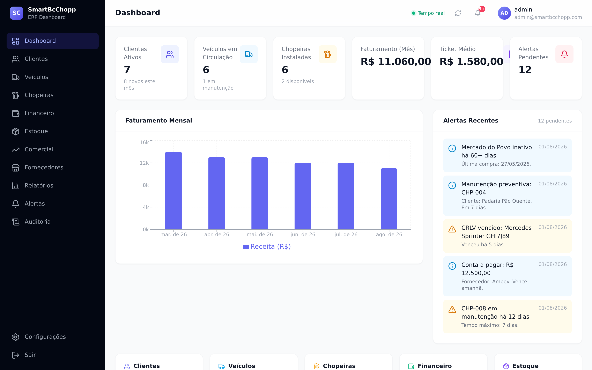
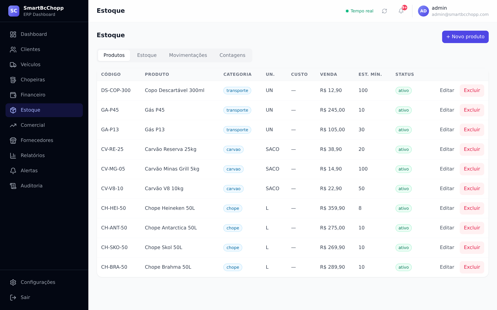
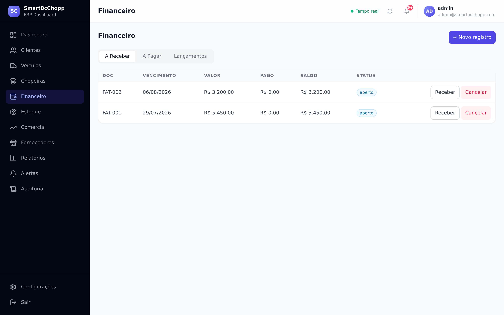
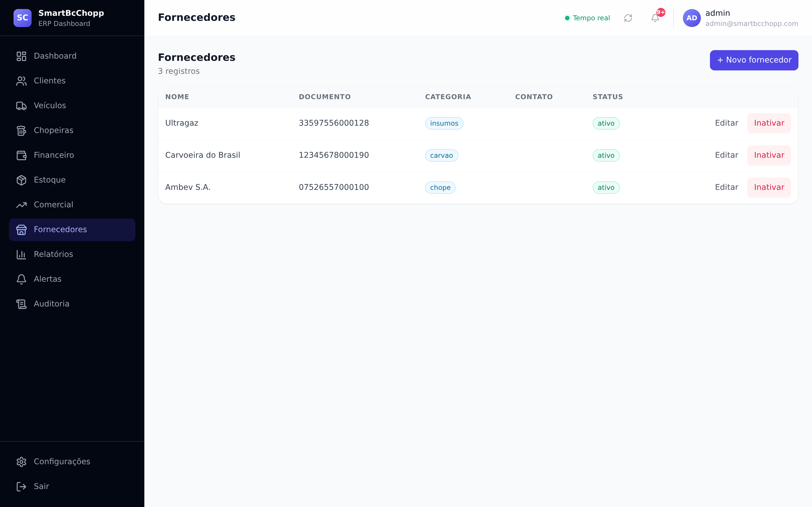
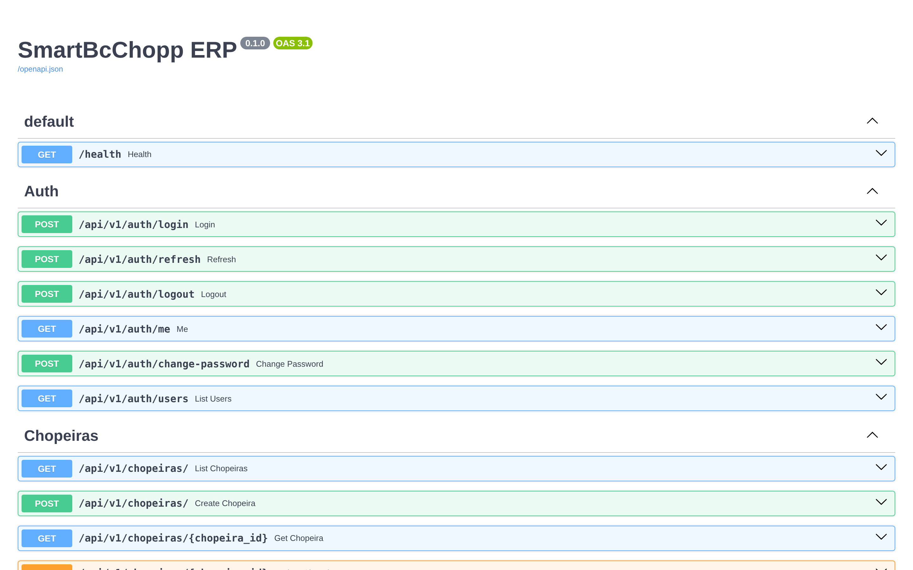

# SmartBcChopp ERP

**ERP inteligente para distribuidoras de chope, carvão e transporte** — dashboard web completo com automações agendadas, atendimento via WhatsApp com IA, frota, financeiro, estoque e API REST documentada.

<div align="center">

[](https://github.com/samnetodev/smartbcchopp-erp/actions)
[](#)
[](#)
[](#)
[](#)
[](#)
[](LICENSE)

**🔗 [Demo ao vivo](https://URL_DEMO.onrender.com)** · **🛠 [API Docs (Swagger)](https://URL_DEMO.onrender.com/docs)** · Credenciais de acesso: **`admin` / `admin123`**

</div>

---

## 📸 Screenshots



| | |
|---|---|
|  |  |
|  |  |

> Veja a [galeria completa](docs/screenshots/) com todas as telas.

---

## Arquitetura

```
                    ┌──────────────┐
                    │   Nginx     │ ← HTTPS, static files, proxy reverso
                    │  (Docker)   │
                    └──────┬───────┘
                           │
              ┌────────────┼────────────┐
              │            │            │
       ┌──────▼─────┐ ┌───▼────┐ ┌────▼──────┐
       │   FastAPI  │ │ Redis  │ │  Worker   │
       │   (API)    │ │ (Cache)│ │ (Futuro)  │
       └──────┬─────┘ └────────┘ └───────────┘
              │
       ┌──────▼─────┐
       │ PostgreSQL │
       │ (Database) │
       └────────────┘
```

### Princípios

- **Clean Architecture + DDD**: `core/` tem zero dependências externas. Domínio isolado em dataclasses puras.
- **Result Monad**: Use cases retornam `Success[T] | Failure[E]`, sem exceções de negócio.
- **Repository Pattern**: ORM (SQLAlchemy) mapeia para entidades de domínio na camada de repositório.
- **DI via dependency-injector**: Container centralizado em `config/container.py`.
- **Automações**: 10 jobs agendados via APScheduler com arquitetura extensível (decorator `@register_job`).
- **WhatsApp + IA**: Agentes de IA (Orquestrador + 5 especialistas) processam intenções via webhook.

---

## ✨ Destaques

- **Clean Architecture + DDD** — `core/` com zero dependências externas; domínio em dataclasses puras, testável isoladamente.
- **Result Monad em todos os use cases** — `Success[T] | Failure[E]`, sem exceções de negócio espalhadas pelo código.
- **24+ entidades modeladas** — clientes, pedidos, estoque multi-depósito, frota (óleo, seguros, multas), chopeiras com manutenção, financeiro (boletos/PIX), fornecedores.
- **10 automações agendadas** — APScheduler com registry extensível (estoque baixo, multas, seguros, boletos, manutenção de chopeiras, clientes inativos...).
- **Atendimento via WhatsApp com IA** — agentes (orquestrador + especialistas) interpretam intenções e respondem consultas/pedidos.
- **Mypy `--strict` + Ruff limpos** em 202 arquivos — qualidade verificada por CI.
- **85+ testes** com PostgreSQL e Redis em pipeline GitHub Actions.
- **Deploy pronto** — Docker multi-stage, Nginx com SSL/rate-limit, backups automáticos e update zero-downtime.

---

## Stack Tecnológica

| Camada | Tecnologia |
|--------|-----------|
| **Backend** | Python 3.13+ / FastAPI / SQLAlchemy 2.0 (async) / asyncpg |
| **Frontend** | React 18 / TypeScript / Vite / Tailwind CSS / Recharts |
| **Banco** | PostgreSQL 16 |
| **Cache** | Redis 7 |
| **Infraestrutura** | Docker / Docker Compose / Nginx |
| **Automação** | APScheduler 3.10+ |
| **WhatsApp** | Evolution API / Agentes de IA (LLM) |
| **Qualidade** | Ruff / MyPy / Pytest / Coverage |

---

## Funcionalidades

### Módulos
- **Dashboard**: Visão geral com gráficos (faturamento, inadimplência, chopeiras, estoque, veículos)
- **Clientes**: Cadastro completo, histórico de compras, geolocalização (ViaCEP + Google Maps)
- **Pedidos**: Criação, status, faturamento, logística
- **Estoque**: Controle multi-produto (chope, carvão, gás), níveis críticos
- **Frota**: Veículos, multas, seguros, documentação, troca de óleo
- **Financeiro**: Contas a pagar/receber, boletos, inadimplência
- **Chopeiras**: Controle de ativos, manutenção, temperatura
- **Fornecedores**: Cadastro e gestão
- **WhatsApp**: Webhook, auto-resposta com IA, consulta de dados, cadastro de pedidos
- **Automações**: 10 jobs inteligentes com alertas no banco

### Automações
| Job | Disparo | Descrição |
|-----|---------|-----------|
| Documentos | 6h | Veículos sem documento anexado |
| Multas | 08:00 | Multas vencendo ou vencidas |
| Troca de Óleo | 07:00 | KM próximo da troca |
| Seguro | 07:30 | Seguros vencendo, veículos sem seguro |
| Clientes Inativos | 09:00 | 60+ dias sem comprar |
| Estoque Baixo | 06:00 | Abaixo do mínimo (3 níveis) |
| Chopeiras Paradas | 08:30 | Manutenção atrasada |
| Boletos | 08:00 | Vencendo/vencidos (5 dias) |
| Contas a Receber | 08:15 | Próximas 7 dias |
| Contas a Pagar | 08:30 | Próximas 7 dias |

---

## Quick Start (Desenvolvimento)

### Pré-requisitos
- Python 3.10+
- Node.js 22+
- Docker e Docker Compose (para PostgreSQL e Redis)
- PostgreSQL 16+ (local ou Docker)

### 1. Clone e configure

```bash
git clone https://github.com/samnetodev/smartbcchopp-erp.git
cd smartbcchopp-erp
cp .env.example .env
# Edite .env com suas configurações
```

### 2. Backend

```bash
make install   # pip install -e ".[dev]"
make dev       # uvicorn --reload na porta 8000
```

### 3. Frontend

```bash
make web-install   # npm install
make web-dev       # vite dev server na porta 5173
```

### 4. Banco de dados (Docker)

```bash
# Apenas PostgreSQL e Redis
docker compose -f docker/docker-compose.yml up -d postgres redis

# Criar tabelas
make migrate
```

### 5. Dados de demonstração (opcional)

```bash
python -m entrypoints.cli.seed_data
# Cria usuário admin / admin123 + 8 clientes, 10 produtos,
# 10 chopeiras, 6 veículos, 12 alertas e histórico financeiro
```

Acesse: http://localhost:5173 (frontend) | http://localhost:8000/docs (API docs)

---

## Deploy em Produção

### Estrutura de deploy

```
servidor (Ubuntu 22.04+)
├── Docker
├── Docker Compose
└── /opt/smartbcchopp/     ← repositório clonado
    ├── docker/
    │   ├── docker-compose.yml    ← produção
    │   ├── Dockerfile            ← API
    │   ├── Dockerfile.web        ← Frontend + Nginx
    │   ├── nginx/                ← Configs Nginx
    │   └── backup/               ← Scripts de backup
    ├── scripts/
    │   ├── setup.sh              ← Instalação fresh
    │   └── update.sh             ← Atualização
    └── .env                      ← Config secreta
```

### Instalação automática (servidor limpo)

```bash
# Como root, com domínio configurado:
export DOMAIN=meu-dominio.com
export EMAIL=admin@meu-dominio.com
curl -fsSL https://raw.githubusercontent.com/yourorg/smartbcchopp/main/scripts/setup.sh | bash
```

O script automatiza:
1. Instala Docker + Docker Compose
2. Clona o repositório em `/opt/smartbcchopp`
3. Gera secrets aleatórios (SECRET_KEY, JWT_SECRET_KEY, DB_PASSWORD)
4. Obtém certificado SSL via Let's Encrypt
5. Sobe todos os serviços (postgres, redis, api, nginx, certbot)
6. Configura backup automático diário (cron)

### Instalação manual

```bash
# 1. Preparar servidor
sudo apt update && sudo apt install -y git curl
curl -fsSL https://get.docker.com | bash

# 2. Clonar
sudo mkdir -p /opt
sudo git clone https://github.com/yourorg/smartbcchopp.git /opt/smartbcchopp
cd /opt/smartbcchopp

# 3. Configurar ambiente
cp .env.example .env
# Edite .env com suas credenciais

# 4. Obter SSL (se tiver domínio)
docker compose -f docker/docker-compose.yml up -d nginx
docker compose -f docker/docker-compose.yml run --rm certbot \
    certonly --webroot -w /var/www/certbot \
    -d seu-dominio.com --email admin@seu-dominio.com --agree-tos

# 5. Subir tudo
make docker-prod
```

### Atualização (zero-downtime)

```bash
sudo ./scripts/update.sh
```

O script:
1. Faz backup do banco de dados
2. Faz backup da configuração atual (rollback)
3. Faz pull do código mais recente
4. Reconstrói imagens Docker
5. Faz rolling update do API (scale up + health check + scale down)
6. Executa migrations
7. Limpa imagens antigas

Para rollback após falha:
```bash
sudo ./scripts/update.sh --rollback
```

---

## Estrutura do Projeto

```
├── app/
│   └── main.py                    # FastAPI app factory, lifespan, health
├── api/
│   ├── routes/v1/                 # Endpoints HTTP (thin, delegam para use cases)
│   ├── serializers/               # Schemas Pydantic (request/response)
│   ├── middlewares/               # Error handler, request ID, CORS
│   └── deps.py                    # Dependências FastAPI (get_uow, etc.)
├── core/
│   ├── domain/
│   │   ├── entities/              # Entidades (dataclasses puras)
│   │   ├── value_objects/         # VOs
│   │   └── events/                # Domain events
│   ├── application/usecases/      # Casos de uso (orquestração)
│   └── shared/                    # Result monad, interfaces
├── database/
│   ├── models/                    # SQLAlchemy ORM models
│   ├── repositories/              # Implementações dos repositórios
│   ├── migrations/                # Alembic migrations
│   └── session.py                 # Async session factory + UoW
├── config/
│   ├── container.py               # DI wiring (dependency-injector)
│   ├── settings.py                # Pydantic Settings
│   └── logging.py                 # Logging estruturado (text/json)
├── infrastructure/
│   ├── automation/                # APScheduler jobs, registry, scheduler
│   └── messaging/integrations/    # WhatsApp (Evolution API), event bus
├── agents/                        # Agentes de IA (orquestrador + 5 agentes)
├── web/                           # Frontend React + TypeScript + Vite
├── docker/                        # Dockerfiles, nginx, backup, monitoring
│   ├── nginx/                     # Configurações Nginx
│   ├── backup/                    # Scripts de backup/restore
│   └── monitoring/                # Health checks
├── scripts/                       # setup.sh, update.sh, deploy.sh
├── .github/workflows/             # CI/CD (GitHub Actions)
└── tests/                         # Testes unitários e de integração
```

---

## Comandos

### Desenvolvimento

| Comando | Descrição |
|---------|-----------|
| `make install` | Instalar dependências Python |
| `make dev` | Iniciar servidor dev (uvicorn --reload) |
| `make lint` | Ruff lint com autofix |
| `make typecheck` | MyPy type checking |
| `make test` | Rodar testes (pytest) |
| `make test-cov` | Testes com cobertura |
| `make migrate` | Aplicar migrations pendentes |
| `make makemigrations message="desc"` | Criar nova migration |
| `make web-install` | Instalar dependências Node |
| `make web-dev` | Iniciar servidor dev Vite |

### Docker

| Comando | Descrição |
|---------|-----------|
| `make docker-up` | Subir serviços dev (com --reload) |
| `make docker-prod` | Subir serviços produção |
| `make docker-down` | Parar serviços |
| `make docker-logs service=api` | Ver logs de um serviço |
| `make docker-ps` | Listar containers |
| `make docker-clean` | Remover volumes (destrutivo) |
| `make backup` | Backup manual do banco |
| `make restore file=backup.sql` | Restaurar backup |

### Produção

| Comando | Descrição |
|---------|-----------|
| `make setup` | Instalação completa (servidor limpo) |
| `make update` | Atualizar aplicação (zero-downtime) |

---

## API Documentation

Com o servidor rodando:

| URL | Descrição |
|-----|-----------|
| `/docs` | Swagger UI |
| `/redoc` | Redoc UI |
| `/openapi.json` | OpenAPI Schema |
| `/health` | Health check |

Endpoints disponíveis em `/api/v1/*`:
- `auth/` — Autenticação JWT
- `customers/` — Clientes
- `orders/` — Pedidos
- `products/` — Produtos
- `chopeiras/` — Chopeiras
- `inventory/` — Estoque
- `fleet/` — Frota e veículos
- `financial/` — Financeiro
- `suppliers/` — Fornecedores
- `dashboard/` — Dashboard
- `whatsapp/` — WhatsApp (webhook, conversas, envio)
- `automation/` — Jobs e alertas

---

## CI/CD

O pipeline GitHub Actions em `.github/workflows/ci.yml`:

| Stage | Descrição |
|-------|-----------|
| **lint** | Ruff + MyPy |
| **test** | Pytest (com PostgreSQL e Redis via serviços Docker) + cobertura |
| **frontend** | `npm ci` + TypeScript `tsc` + build de produção |
| **build** | Docker build + push para GitHub Container Registry (branch `main`) |
| **deploy** | Deploy automático via SSH para produção (apenas com secrets configurados) |

Badge de CI:

[](https://github.com/samnetodev/smartbcchopp-erp/actions)

### Secrets necessários no GitHub

| Secret | Descrição |
|--------|-----------|
| `DEPLOY_HOST` | IP do servidor de produção |
| `DEPLOY_USER` | Usuário SSH |
| `DEPLOY_KEY` | Chave privada SSH |
| `CODECOV_TOKEN` | Token do Codecov (cobertura) |

---

## Backup e Restore

### Backup automático (cron no servidor)
O script `scripts/setup.sh` configura backup diário às 03:00.

### Backup manual

```bash
make backup
# ou via Docker:
docker compose -f docker/docker-compose.yml exec postgres /backup/backup.sh
```

Os backups são salvos em `docker/backup/backups/` com retenção de 30 dias.

### Restore

```bash
make restore file=backups/smartbcchopp_20260101_030000.dump
# ou via Docker:
docker compose -f docker/docker-compose.yml exec postgres /backup/restore.sh backups/smartbcchopp_20260101_030000.dump
```

---

## Monitoramento

### Health checks

| Serviço | Endpoint/Comando |
|---------|-----------------|
| API | `GET /health` |
| PostgreSQL | `pg_isready` (Docker healthcheck) |
| Redis | `redis-cli ping` (Docker healthcheck) |
| Nginx | `GET /health` (página estática) |

### Logs

- **Nginx**: JSON estruturado em `/var/log/nginx/` (dentro do container)
- **API**: JSON estruturado via `LOG_FORMAT=json` (stdout, capturado pelo Docker)
- **Docker**: `docker compose logs -f api` para tempo real

### Comandos úteis

```bash
# Ver logs de todos os serviços
docker compose -f docker/docker-compose.yml logs -f

# Ver logs de um serviço específico
docker compose -f docker/docker-compose.yml logs -f api

# Verificar health dos containers
docker compose -f docker/docker-compose.yml ps

# Estatísticas de uso
docker stats
```

---

## Variáveis de Ambiente

| Variável | Obrigatória | Padrão | Descrição |
|----------|------------|--------|-----------|
| `SECRET_KEY` | Sim | `change-me` | Chave secreta da aplicação |
| `DATABASE_URL` | Sim | - | URL asyncpg do PostgreSQL |
| `DATABASE_SYNC_URL` | Sim | - | URL sync do PostgreSQL (Alembic) |
| `REDIS_URL` | Sim | - | URL do Redis |
| `JWT_SECRET_KEY` | Sim | `change-me` | Chave para JWT |
| `POSTGRES_PASSWORD` | Sim (Docker) | - | Senha do banco |
| `SERVER_NAME` | Sim (Docker) | - | Domínio do servidor |
| `DEBUG` | Não | `false` | Modo debug |
| `LOG_FORMAT` | Não | `json` | `text` ou `json` |
| `CORS_ORIGINS` | Não | `["*"]` | Origens permitidas (JSON array) |
| `WHATSAPP_API_KEY` | Não | - | API Key da Evolution API |
| `GOOGLE_MAPS_API_KEY` | Não | - | Google Maps API Key |
| `NFE_API_KEY` | Não | - | API Key SEFAZ |
| `PAGARME_API_KEY` | Não | - | API Key Pagar.me |

---

## Contribuição

1. Fork o repositório
2. Crie uma branch: `git checkout -b feat/minha-feature`
3. Commit suas mudanças: `git commit -am 'feat: adiciona nova funcionalidade'`
4. Push: `git push origin feat/minha-feature`
5. Abra um Pull Request

### Padrões de commit

- `feat:` — Nova funcionalidade
- `fix:` — Correção de bug
- `refactor:` — Refatoração
- `test:` — Testes
- `docs:` — Documentação
- `infra:` — Infraestrutura/Docker/CI

---

## Licença

MIT © SmartBcChopp
